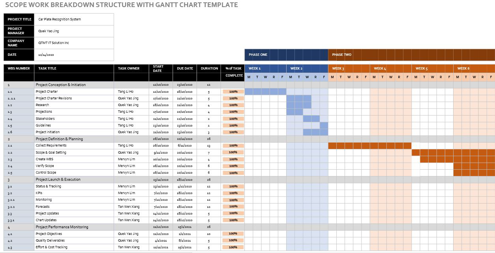
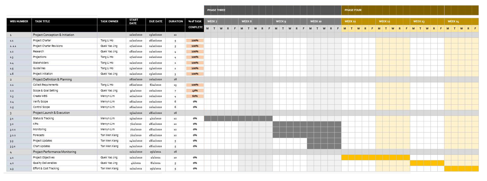

# PROJECT OVERVIEW

## E. COMPLETING THE PROJECT
### Closing Checklist
 

#### 1. Customer Acceptance Form

#### 2. Lessons Learned Document

#### 3. Final Project Report
**CAR PLATE RECOGNITION SYSTEM**

**1.0 PROJECT OBJECTIVES**

The car plate recognition system done by QTMT Inc. was intended to develop an artificial intelligence system that are able to detect Malaysia car number plate. Besides, one of the aims of QTMT Inc. is to develop a system that are able to recognize the character of the car number plate. Not only that, we also intend to build an application programming interface (API) for the future ease if use as the integration module.

**2.0 SUMMARY OF PROJECT RESULTS**

After the system has been completed, we tested the accuracy of the system. The system is 30%

**3.0 ORIGINAL AND ACTUAL SCHEDULE**

The project member sticks to the Gantt chart scheduled so, the actual progress fits the original schedule.

**4.0 ORIGINAL AND ACTUAL BUDGET**

The actual budget matches the original budget, which means that the team has followed the budget planned at the beginning of the project and does not use any excessive money.

**5.0 PROJECT ASSESSMENT**

**5.1 SCOPE**

This coin counting application will define the project's scope. For instance, the project will only recognize coins from a single nation and the most recent generation. For instance, each coin must be placed separately on the scanning surface. For instance, the project will only recognize coins and will not take bank notes. Instead of stacking the coins, the user must sort them next since image processing requires that they be captured. Furthermore, because the coin size is only applicable to Malaysian coins, other nations like Korea will not be able to use this program. The fraudulent coins will also be recognized and stopped from counting.

**5.2 OBJECTIVES**

Cloud Revel Solution is able to achieve the objective since this application is using artificial intelligence powered which is image processing to detect coins and calculate its coin total. Besides, the application is able to collaboration with vending machine and it could ease user to use the vending machine with artificial intelligence power. By using this method, our object to develop an application that could ease user is being met.

**5.3 IMPACTS**

By creating this system, it could save customer’s time when want to purchase food/drink from vending machine. All customers have to do is just put all their coins on the space given and the vending machine will automatically calculate its coins. So, the next customers didn’t have to wait much time as this application will save lot of time for each customers. In addition, the Milano Vending also gain advantages because the applications can detect the fake coins. So, the fake coins will not be calculated.recognize. 

**6.0 TRANSITION PLAN**

Cloud Revel Solution staff will provide support when require. The main work of support provided by Cloud Revel Solution staff on the coin counting application project are shown as below:

i)	Maintain the application

ii)	Fix bugs and errors

iii)	Provide guidelines for first time use in apply application into the machine as well as on how to use and works

iv)	Report information to senior management on monthly basis

#### 4. Close Contract

   
##### Next: [Project Presentation](F-PROJECT_PRESENTATION.md)
